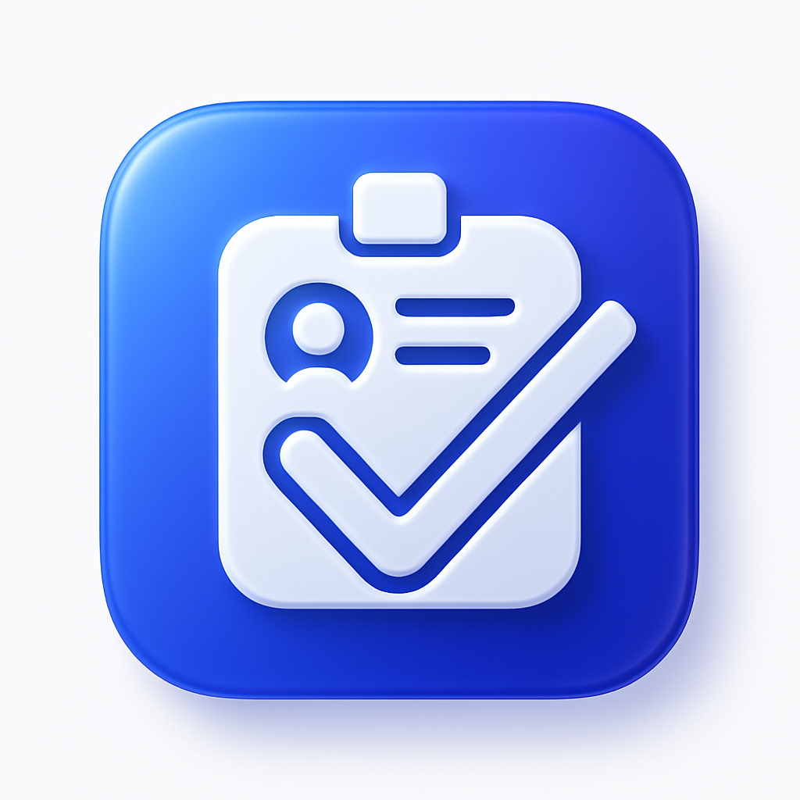

<p align="center">
  
</p>

# LatePass Portal

A comprehensive Flutter-based mobile application designed to streamline and manage student attendance and late passes within an educational institution.

## ✨ Features

-   **Multi-Tiered Access Control**:
    -   **Student View**: Allows students to view their own attendance records.
    -   **Admin/Faculty View**: Enables administrators and faculty to manage student records, issue digital late passes, and view attendance reports.
    -   **Superadmin View**: Provides full control over the system, including the ability to add or remove other administrators.
-   **Secure Authentication**:
    -   Admins and Superadmins log in securely using Email/Password or Google Sign-In.
    -   Students access their records via a guest/anonymous sign-in.
    -   Login sessions are persisted, allowing users to stay logged in across app restarts.
-   **Student Management**:
    -   Manually add individual student records.
    -   Bulk import students from a CSV or Excel (`.xlsx`) file.
    -   Remove students from the database.
-   **Attendance Tracking**:
    -   (Functionality to be built) Admins can mark students as tardy or absent.
    -   (Functionality to be built) ID scanning (e.g., barcodes) for quick check-ins.
-   **Reporting**:
    -   (Functionality to be built) Generate and export attendance reports.

## 📂 Project Structure

The project follows a standard Flutter feature-based structure:

```
lib/
├── admin/         # Admin-specific widgets and pages
├── login/         # Login, session management, and routing
├── shared/        # Reusable widgets (e.g., AppDrawer)
├── student/       # Student-specific widgets and pages
├── superadmin/    # Superadmin-specific widgets and pages
├── main.dart      # App entry point and theme configuration
└── ...
```

## 🚀 Getting Started

### Prerequisites

-   [Flutter SDK](https://docs.flutter.dev/get-started/install)
-   A configured Firebase project.

### Setup

1.  **Clone the repository:**
    ```bash
    git clone https://github.com/ReverseEngineeringDude/LatePass.git
    cd latepass
    ```

2.  **Install dependencies:**
    ```bash
    flutter pub get
    ```

3.  **Configure Firebase:**
    -   Set up a new Firebase project at [console.firebase.google.com](https://console.firebase.google.com/).
    -   Add an Android and/or iOS app to your Firebase project.
    -   Follow the Firebase setup instructions and place the generated `google-services.json` (for Android) and `GoogleService-Info.plist` (for iOS) in the appropriate directories.
    -   Enable **Email/Password** and **Google Sign-In** as authentication methods in the Firebase console.
    -   Set up **Firestore** as your database.

4.  **Define User Roles:**
    -   **Superadmin**: To designate a superadmin, add their Google account email to the `_superAdminEmails` list in `lib/login/login_page.dart`.
    -   **Admins**: Admins can be added dynamically from within the app by a logged-in Superadmin.

### Running the Application

```bash
flutter run
```

## 👥 User Roles

-   **Superadmin**: The highest level of authority. Can manage admins and has access to all administrative features. Logs in via a specific, whitelisted Google account.
-   **Admin/Faculty**: Standard administrative users who can manage student data. They are created by a Superadmin and log in with an email and password.
-   **Student**: Can view their own attendance data. Access is provided through a simple, anonymous guest login.
